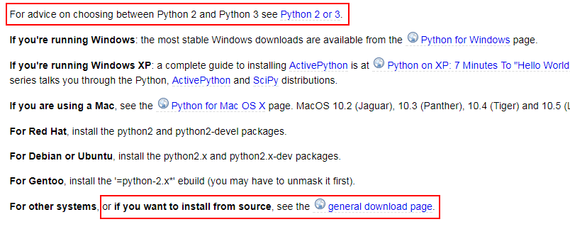
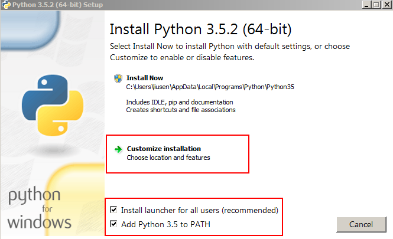
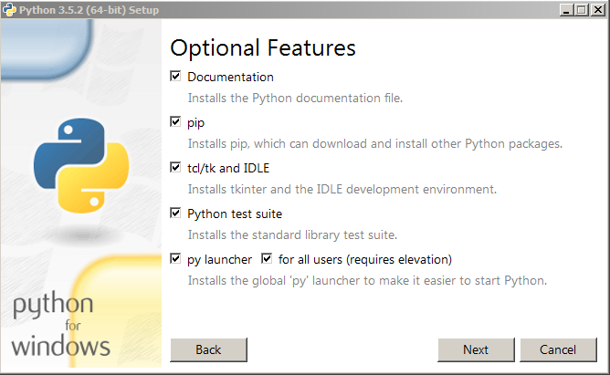
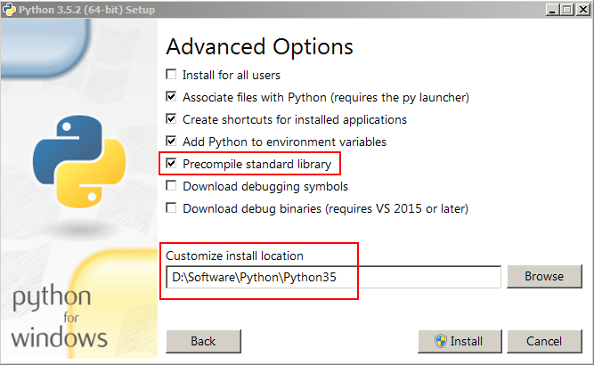
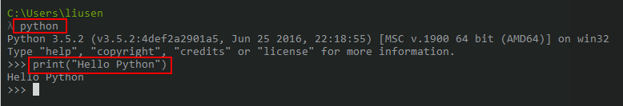

# Python的安装 #


## 1、Python的版本选择 ##

Python2.x版本和3.x版本不是连续的两个版本，可以当做独立的语言来看待。

（1）如果是学习用，使用3.x，历史的车轮滚滚向前

（2）如果在企业里做开发，应该以企业的主流平台作为参照。例如生产环境下里主流操作系统为CentOS6.5（默认安装Python2.6），那么编程的时候最好能直接用Python2.6来实现，不然兼容问题会很麻烦。	

下载版本说明

	https://wiki.python.org/moin/BeginnersGuide/Download




## 2、下载Python ##

下载地址，根据自己的需求选择版本
	
	https://www.python.org/downloads/
	https://www.python.org/ftp/python/
	https://www.python.org/downloads/release/python-352/

下载3.5.2版本

	#windows（64位地址）
	https://www.python.org/ftp/python/3.5.2/python-3.5.2-amd64.exe
	#windows（32位地址）
	https://www.python.org/ftp/python/3.5.2/python-3.5.2.exe
	#Linux地址（不区分64和32）
	https://www.python.org/ftp/python/3.5.2/python-3.5.2.tgz

## 3、Linux环境下解压和编译Python ##

安装虚拟机软件，然后在虚拟机中安装桌面版本的Linux操作系统

	#使用root登录
	mkdir /export
	cd /export
	wget https://www.python.org/ftp/python/3.5.2/python-3.5.2.tgz
	tar -zxvf python-3.5.2.tgz
	cd Python-3.5.2
	yum -y install gcc
	./configure
	make
	make install

## 4、Windows下安装Python ##

运行环境：Win7-64bit

先勾选：Add Python 3.5 to PATH  
然后点击：Customize installation  
跳过一个页面之后，修改安装路径：Customize install local







## 5、测试Python安装是否成功 ##

在控制台输入`python`启动python运行窗口，输入`print("Hello Python")`打印字符串。启动python的时候，会有python的版本号信息。



从python shell進入和退出：

	#進入python shell
	python
	#退出python shell
	exit()

打印python的關鍵字：

```python
>>> import keyword
>>> keyword.kwlist
['False', 'None', 'True', 'and', 'as', 'assert', 'break', 'class', 'continue', 'def', 'del', 'elif', 'else', 'except', 'finally', 'for', 'from', 'global', 'if', 'import', 'in', 'is', 'lambda', 'nonlocal', 'not', 'or', 'pass', 'raise', 'return', 'try', 'while', 'with', 'yield']
```


