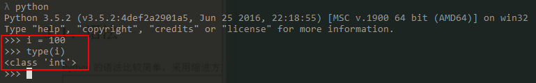
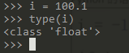
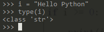
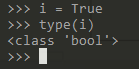
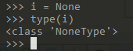
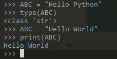
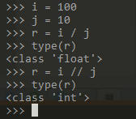

# Python基础:语法 #

Python的语法比较简单，采用缩进方式

## 常见的类型： ##

	#定义整型
	i = 100
	type(i)

	#定义浮点数
	i = 100.1
	type(i)

	#定义字符串
	i = "Hello Python"
	type(i)

	#定义布尔类型
	i = True
	type(i)

	#定义空值
	i = None
	type(i)

在上述示例中，`i`属于引用变量，指向一个内在地址值。

在Python中，通常用全部大写的变量名表示常量。

	#定义常量
	ABC = "Hello Python"
	type(ABC)

## 除法 ##

在Python中，有两种除法: `/`和`//`  
`/`除法计算结果是浮点数，即使是两个整数恰好整除，结果也是浮点数  
`//`除法计算称为地板除，两个整数的除法仍然是整数  

	i = 100
	j = 10
	r = i / j
	type(r)
	r = i // j
	type(r)

