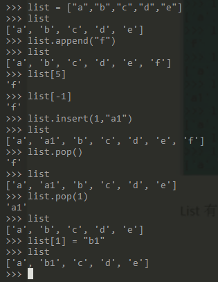
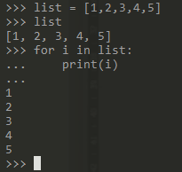
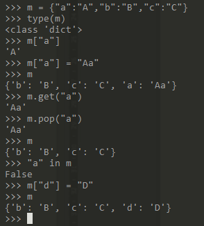
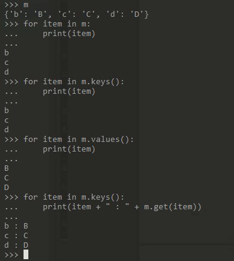
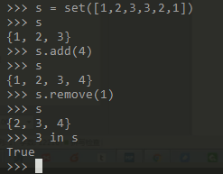
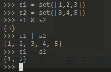
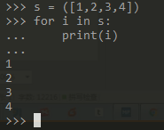
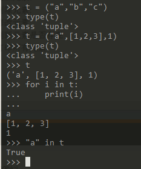

# Python基础:数据结构 #

数据结构：

Java：数组、list、map、set
Python：list、dict(dictionary,map)、set、元组（元素的组合）

> Python中好像没有“数组”，但多了“元组”

## 1、list ##

Python内置的一种类型是列表：list。list是一种有序的集合，可以随时添加和删除其中的元素。list有序集合中的元素，可以是list。

list操作：定义、增加元素、删除元素、修改元素、判断元素是否存在、打印所有元素

定义：使用中括号，将元素用逗号分隔，依次存放 
 
增加元素：

	list.insert(index,value)  

删除元素：

	从末尾删除 list.pop()
	根据索引值删除 list.pop(index)

修改元素：

	list[index] = value

判断元素是否存在： 

	bool = value in list

打印所有元素：

	for i in list:               #循环打印元素
	    print(i)

示例1：

	list = ["a","b","c","d","e"]  #定义list
	list.append("f")              #添加元素
	list[5]                       #查询元素
	list[-1]
	list.insert(1,"a1")           #插入元素
	list
	list.pop()                    #弹出元素
	list
	list.pop(1)
	list
	list[1] = "b1"                #元素赋值
	list

示例2：

	list = [1,2,3,4,5]           #元素类型为int
	for i in list:               #循环打印元素
	    print(i)

	7 in list                    #元素是否存在于list内
	2 in list

## 2、dict(dictionary map) ##

dict全称dictionary，在其他语言中也称为map，使用key-value存储，具有极快的查找速度。

和list比较，dict有如下特点：

	（1）查找和插入的速度极快，不会随着key的增加而变慢
	（2）需要占用大量的内存，内存浪费多

而list相反：

	（1）查找和插入的时间随着元素的增加而增加
	（2）占用空间小，浪费内存少

所以，dict是用空间来换取时间的一种方法。

dict操作：定义、增加元素、删除元素、修改元素、判断元素是否存在、打印所有元素

定义：

	{"k1":"v1","k2":"v2"}

增加元素：

	m["key"] = value

删除元素：

	m.pop("key")

修改元素：

	m["key"] = new value

判断元素是否存在：

	bool = "key" in map

打印所有元素：

	for item in m:
	    print(item)
	
	for item in m.keys():
	    print(item)
	
	for item in m.values():
	    print(item)
	
	for item in m.keys():
	    print(item + " : " + m.get(item))

示例1：

	m = {"a":"A","b":"B","c":"C"}    #定义
	type(m)
	m["a"]                           #取值
	m["a"] = "Aa"                    #赋值，也可以添加新元素
	m
	m.get("a")                       #取值
	m.pop("a")                       #删除key
	m
	"a" in m                         #判断是否存在

示例2（打印所有元素）：

	for item in m:
	    print(item)
	
	for item in m.keys():
	    print(item)
	
	for item in m.values():
	    print(item)
	
	for item in m.keys():
	    print(item + " : " + m.get(item))

## 3、set ##

set可以看成数字意义上的无序和无重复元素的集合

set操作：定义、增加元素、删除元素、判断是否存在、打印所有元素

定义：小括号中存放一个中括号，所有的元素放在中括号内。

增加元素：

	set.add(value)

删除元素：

	set.remove(value)

修改元素：不支持

判断元素是否存在：

	bool = value in set

打印所有元素：

	for i in s:
	    print(i)

示例1：

	s = set([1,2,3,3,2,1])     #创建
	s
	s.add(4)                   #添加
	s.remove(1)                #删除
	s
	3 in s                     #判断是否存在

> set中不存在“修改元素”的概念，因为它并没有类似于map的key可以进行索引到

两个set可以做数学意义上的交集、并集、差集等操作

示例2：

	s1 = set([1,2,3])
	s2 = set([3,4,5])
	s1 & s2               #交集
	s1 | s2               #并集
	s1 - s2               #差集

打印set里的元素

	s = ([1,2,3,4])
	for i in s:
	    print(i)

## 4、tuple ##

tuple（元组），即元素的组合。tuple是另一种有序列表，它和list非常类似，但是tuple一旦初始化就不能修改。tuple中的元素可以是不同类型的。

为什么有了list，还需要tuple呢？tuple优点：

	（1）Tuple中的类型很丰富，可以包含不同类型的元素
	（2）Tuple一旦被创建就无法修改（在某些情况，有这种需求）

定义：

	(value1,value2,value3)

增加元素：不支持
删除元素：不支持
修改元素：不支持
获取元素：

	t[index]

判断元素是否存在：

	bool = value in tuple

打印所有元素：

	for i in t:
	    print(i)

示例：

	t = ("a","b","c")
	t[0]
	type(t)
	t = ("a",[1,2,3],1)
	type(t)
	"a" in t
	for i in t:
	    print(i)

