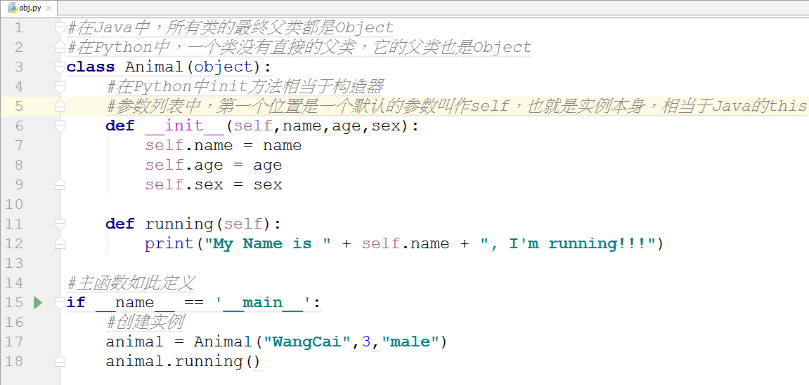

# Python基础:面向对象 #

类、类中的方法、类的中成员变量、类中的构造器、类继承的父类、多态

## 1、类的定义 ##

类中的方法:

	def method_name(self)

类的中成员变量:

	self.name
	self.age

类中的构造器:

	def __init__(self,参数列表)

示例1：类、类中的方法、类的成员变量、类的构建器

	#在Java中，所有类的最终父类都是Object
	#在Python中，一个类没有直接的父类，它的父类也是Object
	class Animal(object):
	    #在Python中init方法相当于构造器
	    #参数列表中，第一个位置是一个默认的参数叫作self，也就是实例本身，相当于Java的this
	    def __init__(self,name,age,sex):
	        self.name = name
	        self.age = age
	        self.sex = sex
	
	    def running(self):
	        print("My Name is " + self.name + ", I'm running!!!")
	
	#主函数如此定义
	if __name__ == '__main__':
	    #创建实例
	    animal = Animal("WangCai",3,"male")
	    animal.running()

去掉注释后的代码如下：

	class Animal(object):
	    def __init__(self,name,age,sex):
	        self.name = name
	        self.age = age
	        self.sex = sex
	
	    def running(self):
	        print("My Name is " + self.name + ", I'm running!!!")
	
	if __name__ == '__main__':
	    animal = Animal("WangCai",3,"male")
	    animal.running()

## 2、类的继承 ##

	#继承一个类时，将父类的类名放到Dog的括号中
	class Dog(Animal):
	    pass
	
	#主函数如此定义
	if __name__ == '__main__':
	    #创建实例
	    #animal = Animal("WangCai",3,"male")
	    #animal.running()
	    dog = Dog("Tom",3,"male")
	    dog.running()

## 3、多态 ##

多态，方法在定义中需要一个父类的参数，而实际传入时可以传入一个子类。  

	class Person(object):
	
	    def printAnimal(self,animal):
	        animal.running()
	
	#主函数如此定义
	if __name__ == '__main__':
	    #创建实例
	    #animal = Animal("WangCai",3,"male")
	    #animal.running()
	    dog = Dog("Tom",3,"male")
	    #dog.running()
	    person = Person()
	    person.printAnimal(dog)

Python的多态是伪多态，是鸭子类型：在python语言中，对类检测时，并没有严格检测类的继承关系，因此传入的不一定是Animal的子类，只要有running方法就可以了。

	class A(object):
	    def running(self):
	        print("AAAAA")
	
	class Person(object):
	
	    def printAnimal(self,animal):
	        animal.running()
	
	#主函数如此定义
	if __name__ == '__main__':
	    #创建实例
	    #animal = Animal("WangCai",3,"male")
	    #animal.running()
	    #dog = Dog("Tom",3,"male")
	    #dog.running()
	    a = A()
	    person = Person()
	    person.printAnimal(a)

鸭子类型：只要你走路像鸭子，就认为你是鸭子。

“鸭子类型”的语言是这么推断的：一只鸟走起来像鸭子、游起泳来像鸭子、叫起来也像鸭子，那它就可以被当做鸭子。也就是说，它不关注对象的类型，而是关注对象具有的行为(方法)。

完整obj.py内容如下：

	#在Java中，所有类的最终父类都是Object
	#在Python中，一个类没有直接的父类，它的父类也是Object
	class Animal(object):
	    #在Python中init方法相当于构造器
	    #参数列表中，第一个位置是一个默认的参数叫作self，也就是实例本身，相当于Java的this
	    def __init__(self,name,age,sex):
	        self.name = name
	        self.age = age
	        self.sex = sex
	
	    def running(self):
	        print("My Name is " + self.name + ", I'm running!!!")
	
	#继承一个类时，将父类的类名放到Dog的括号中
	class Dog(Animal):
	    pass
	
	class A(object):
	    def running(self):
	        print("AAAAA")
	
	class Person(object):
	
	    def printAnimal(self,animal):
	        animal.running()
	
	#主函数如此定义
	if __name__ == '__main__':
	    #创建实例
	    #animal = Animal("WangCai",3,"male")
	    #animal.running()
	    #dog = Dog("Tom",3,"male")
	    #dog.running()
	    a = A()
	    person = Person()
	    person.printAnimal(a)

去掉注释后：

	class Animal(object):
	    def __init__(self,name,age,sex):
	        self.name = name
	        self.age = age
	        self.sex = sex
	
	    def running(self):
	        print("My Name is " + self.name + ", I'm running!!!")
	
	class Dog(Animal):
	    pass
	
	class A(object):
	    def running(self):
	        print("AAAAA")
	
	class Person(object):
	    def printAnimal(self,animal):
	        animal.running()
	
	if __name__ == '__main__':
	    #animal = Animal("WangCai",3,"male")
	    #animal.running()
	    #dog = Dog("Tom",3,"male")
	    #dog.running()
	    a = A()
	    person = Person()
	    person.printAnimal(a)

## 4、魔法方法 ##

- 在Python中，方法名如果是`__xxx__()`的，那么就有特殊的功能，因此叫作“**魔法**”方法
- 当使用print输出对象的时候，只要自己定义了`__str__(self)`方法，那么就会打印在这个方法中return的数据。

> 至此结束
