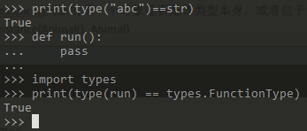
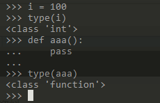
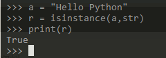
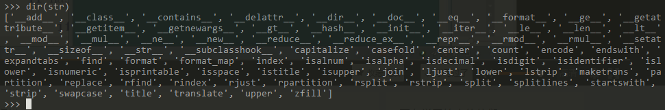

# Python基础:获取对象信息 #

获取类的信息：

1. 如何获取一个变量的类型
2. 如何比较一个变量的类型
3. 如何查看一个类有多少方法
4. 如何查看一个类有多少属性

## 1、type ##

我们来判断对象类型，使用`type()`函数

	#判断基本类型
	print(type("abc")==str)
	print(type("abc")==int)
	print(type("abc")==list)
	#判断函数
	def run():
	    pass
	
	import types
	print(type(run) == types.FunctionType)

示例1：整型、方法

	i = 100
	type(i)
	def aaa():
	    pass
	
	type(aaa)

示例2：类

	class HelloWorld(object):
	    pass
	
	if __name__ == '__main__':
	    helloWorld = HelloWorld()
	    print(type(helloWorld))

输出：

	<class '__main__.HelloWorld'>

## 2、isinstance ##

isinstance()判断的是一个对象是否是该类型本身，或者位于该类型的父继承链上。

	a = "Hello Python"
	r = isinstance(a,str)
	print(r)

## 3、dir ##

要获得一个对象的所有属性和方法，可以使用dir()函数，它返回一个包含字符串的list

	dir(str)
	dir(animal)

> 带下划线的方法（例如__add__）就是内置的方法，开发者自己写的方法一般不带下划线。

示例：

	class Animal(object):
	    def run(self):
	        print("Animal is running...")
	
	    def __len__(self):
	        return 1000
	
	if __name__ == '__main__':
	    animal = Animal()
	    print(len(animal))
	    print(dir(animal))

输出：

	1000
	['__class__', '__delattr__', '__dict__', '__dir__', '__doc__', '__eq__', '__format__', '__ge__', '__getattribute__', '__gt__', '__hash__', '__init__', '__le__', '__len__', '__lt__', '__module__', '__ne__', '__new__', '__reduce__', '__reduce_ex__', '__repr__', '__setattr__', '__sizeof__', '__str__', '__subclasshook__', '__weakref__', 'run']

## 4、attr ##

仅仅把属性和方法列出来是不够的，配合getattr()、setattr()以及hasattr()，我们可以直接操作一个对象的状态。

	class Animal(object):
	    def __init__(self,name,age,sex):
	        self.name = name
	        self.age = age
	        self.sex = sex
	
	    def running(self):
	        print("My Name is " + self.name + ", I'm running!!!")
	
	if __name__ == '__main__':
	    animal = Animal("TomCat", 3, "male")
	
	    #getattr
	    noneExistAttr = getattr(animal, "noneExistAttr", "defaultValue")
	    print("noneExistAttr: " + noneExistAttr)
	
	    #hasattr + getattr
	    if(hasattr(animal,"name")):
	        nameAttr = getattr(animal,"name","WangCai")
	        print("Animal Name is: " + nameAttr)
	
	    #setattr + getattr
	    setattr(animal, "name", "JerryMouse")
	    nameAttr = getattr(animal, "name", "WangCai")
	    print("Animal's New Name is: " + nameAttr)

输出：

	noneExistAttr: defaultValue
	Animal Name is: TomCat
	Animal's New Name is: JerryMouse

>至些结束

