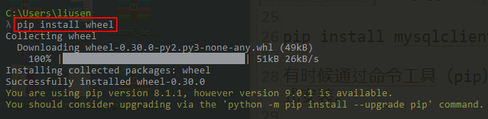
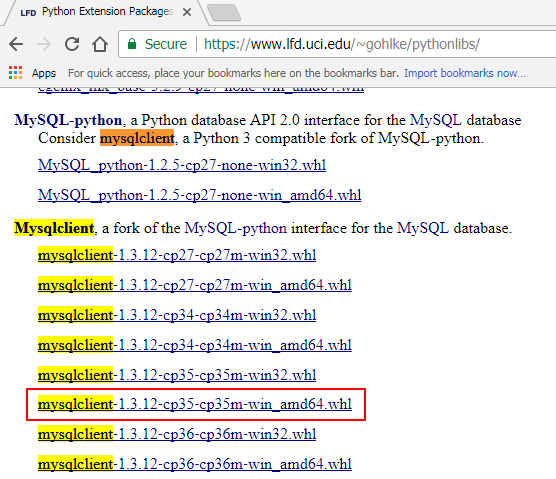
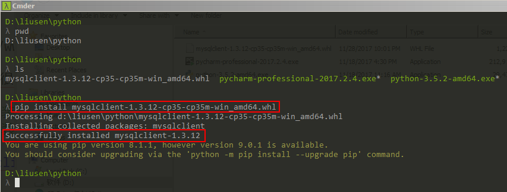

# Python常用代码：数据库操作 #

## 1、准备工作 ##

- 安装一个mysql数据库软件
- 创建一个数据库 test
- 在python的环境下安装一个模块：MySQLdb

### 1.1、什么是MySQLdb？ ###

MySQLdb是用于Python连接MySQL数据库的接口，它实现了Python数据库API规范V2.0。

### 1.2、安装MySQLdb ###

安装MySQL的连接包（MySQLdb），主要有两种方法（推荐使用第二种）：

**第一种：自动安装**

	python3.x版本：pip install mysqlclient
	python 2.x版本：pip install mysql-python

在win7 64bit下，命令工具（pip）安装mysql的驱动，会有一个错误：unable to find vcvarsall.bat错误，基本上无解的，因此不推荐使用。


**第二种：手工安装**

（1）安装wheel

命令：

	pip install wheel



（2）安装mysql驱动

下载地址：

	https://www.lfd.uci.edu/~gohlke/pythonlibs/

选择版本：在网上有很多安装mysql的操作方法，简单概述就是：

	Python 2.x 安装 ysql-python
	Python 3.x 安装 mysqlclient

在网页中，按下`Ctrl+F`查找mysqlclient可以快速的定位到，如下图。我使用的电脑是Win7 64bit安装的3.5.2版本的Python，因此选择了带有“cp35”和“amd64”的版本。



切换到下载目录，使用如下命令安装：

	pip install mysqlclient-1.3.12-cp35-cp35m-win_amd64.whl
	


至此安装完成。

## 2、MySQL操作 ##

创建test数据库

```mysql
CREATE DATABASE `test` DEFAULT CHARACTER SET utf8 COLLATE utf8_general_ci;
```

使用test数据库：
```mysql
USE `test`;
```

## 3、Python操作数据库 ##

### 3.1、HelloWorld:打印MySQL数据库版本 ###

```python
import MySQLdb

#打开数据库连接
db = MySQLdb.connect("localhost","root","root","test")
#使用cursor()方法获取操作游标
cursor = db.cursor()
#使用execute方法执行SQL语句
cursor.execute("SELECT VERSION()")
#使用fetchone()方法获取一条数据库
data = cursor.fetchone()
print("Database version : %s" % data)
#关闭数据库连接
db.close()
```

输出：

	Database version : 5.7.18

### 3.2、创建表 ###

```python
import MySQLdb

#打开数据库连接
db = MySQLdb.connect("localhost","root","root","test")
#使用cursor()方法获取操作游标
cursor = db.cursor()

#如果数据表已经存在，就使用execute()方法删除表
cursor.execute("DROP TABLE IF EXISTS EMPLOYEE")
#创建数据表SQL语句
sql = """CREATE TABLE EMPLOYEE(
            FIRST_NAME CHAR(20) NOT NULL,
            LAST_NAME CHAR(20),
            AGE INT,
            SEX CHAR(1),
            INCOME FLOAT
         )"""
cursor.execute(sql)

#关闭数据库连接
db.close()
```

### 3.3、添加数据 ###

```python
import MySQLdb

#打开数据库连接
db = MySQLdb.connect("localhost","root","root","test")
#使用cursor()方法获取操作游标
cursor = db.cursor()

#SQL插入语句
sql = """INSERT INTO EMPLOYEE(FIRST_NAME,LAST_NAME,AGE,SEX,INCOME)
         VALUES('Lily','Greens',20,'F',2000)"""

try:
    #执行SQL语句
    cursor.execute(sql)
    #提交到数据库执行
    db.commit()
except:
    #Rollback in case there is any error
    db.rollback()

#关闭数据库连接
db.close()
```

### 3.4、查询数据 ###

Python查询MySQL使用fetchone()方法获取单条数据，使用fetchall()方法获取多条数据。

- fetchone():该方法获取下一条查询结果集。结果集是一个对象。
- fetchall():接收全部的返回结果行。
- rowcount:这是一个只读属性，并返回执行execute()方法后影响的行数

```python
import MySQLdb

#打开数据库连接
db = MySQLdb.connect("localhost","root","root","test")
#使用cursor()方法获取操作游标
cursor = db.cursor()

#SQL插入语句
sql = "SELECT * FROM EMPLOYEE \
       WHERE INCOME > '%d' " % (1000)

try:
    #执行SQL语句
    cursor.execute(sql)
    #获取所有记录列表
    results = cursor.fetchall()
    for row in results:
        fname = row[0]
        lname = row[1]
        age = row[2]
        sex = row[3]
        income = row[4]
        #打印结果
        print("fname=%s,lname=%s,age=%d,sex=%s,income=%d" % \
              (fname,lname,age,sex,income))
except:
    #Rollback in case there is any error
    db.rollback()

#关闭数据库连接
db.close()
```
### 3.5、更新数据表数据 ###

```python
import MySQLdb

#打开数据库连接
db = MySQLdb.connect("localhost","root","root","test")
#使用cursor()方法获取操作游标
cursor = db.cursor()

#SQL插入语句
sql = "UPDATE EMPLOYEE SET AGE = AGE + 1 WHERE SEX = '%c'" % ('F')

try:
    #执行SQL语句
    cursor.execute(sql)
    # 提交到数据库执行
    db.commit()
except:
    #Rollback in case there is any error
    db.rollback()

#关闭数据库连接
db.close()
```

### 3.6、删除表数据 ###

```python
import MySQLdb

#打开数据库连接
db = MySQLdb.connect("localhost","root","root","test")
#使用cursor()方法获取操作游标
cursor = db.cursor()

#SQL插入语句
sql = "DELETE FROM EMPLOYEE WHERE AGE > '%d'" % (20)

try:
    #执行SQL语句
    cursor.execute(sql)
    # 提交到数据库执行
    db.commit()
except:
    #Rollback in case there is any error
    db.rollback()

#关闭数据库连接
db.close()
```


