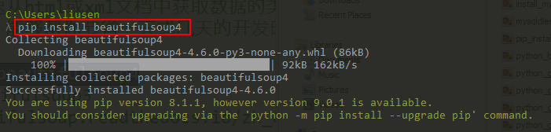

# 爬虫项目：准备 #

## 1、项目需求 ##

需求：

	爬取虎嗅网站的所有新闻，并保存到数据库中。
	https://www.huxiu.com

技术：

	1、爬虫：获取服务器的资源（urllib）、解析HTML网页（BeautifulSoup）
	2、数据库：MySQLdb

业务逻辑分析：

	1、要爬取虎嗅网站的新闻，包括首页和分页信息	（下一页）
	2、需要从首页的资源和分页的资源中获取每个新闻的url链接
		如何获取url：解析网站HTML文件，如果a标签的href属性包含article字段，就表示这是一个新闻
	3、访问新闻的url，解析出想要的字段

## 2、urllib.request回顾 ##

使用urllib包的学习地址：[HOWTO Fetch Internet Resources Using The urllib Package](https://docs.python.org/release/3.2/howto/urllib2.html)

urllib.request是一个Python的用于获取URL模块。

urllib.request提供三种不同的请求方式：

第一种是get请求：

	方式一：urllib.request.urlopen('http://python.org/')

		import urllib.request
		
		url = "http://www.baidu.com"
		response = urllib.request.urlopen(url)
		if response.status == 200:
		    data = response.read()
		    print(type(data))
		    print(data)
		    print(data.decode("utf-8"))

	方式二：先创建一个urllib.request.Request对象，然后将该对象放入urlopen方法中

		import urllib.request
		
		url = "http://www.baidu.com"
		req = urllib.request.Request(url)
		response = urllib.request.urlopen(req)
		
		if response.status == 200:
		    data = response.read()
		    print(data.decode("utf-8"))

第二种是POST请求：携带数据过去，比如登录用户名、密码，注意：需要将数据进行转换urlencode，再放到Request对象中，否则会报错

	import urllib.request
	import urllib.parse
	
	values = {"name":"张三","age":"10"}
	encodeValues = urllib.parse.urlencode(values)
	url = "http://www.baidu.com"
	req = urllib.request.Request(url,encodeValues.encode("utf-8"))
	response = urllib.request.urlopen(req)
	
	if response.status == 200:
	    data = response.read()
	    print(data.decode("utf-8"))

第三种：添加请求头

	import urllib.parse
	import urllib.request
	
	url = 'http://www.baidu.com'
	user_agent = 'Mozilla/4.0 (compatible; MSIE 5.5; Windows NT)'
	values = {'name' : 'Michael Foord',
	          'location' : 'Northampton',
	          'language' : 'Python' }
	headers = { 'User-Agent' : user_agent }
	
	data = urllib.parse.urlencode(values)
	req = urllib.request.Request(url, data.encode("utf-8"), headers)
	response = urllib.request.urlopen(req)
	the_page = response.read()
	print(the_page.decode("utf-8"))

## 3、beautifulSoup ##

罗列问题：

	1、beatifulSoup是什么
		是一个能够快速从html或xml文档中获取数据的类库
		官方的说法是，能够帮你节省一天或几天的开发时间
	2、如何安装
		pip install beautifulsoup4
		旧版本：beautifulsoup3
		http://beautifulsoup.readthedocs.io/zh_CN/latest/

	3、如何使用
		本文中只讲解通过beautifulSoup select选择器获取数据
		还有许多其他用法，需要单独学习
		CSS选择器
		Beautiful Soup支持大部分的CSS选择器 https://www.w3.org/TR/CSS2/selector.html。在Tag或BeautifulSoup对象的.select()方法中传入字符串参数，即可使用CSS选择器的语法找到tag

beautifulSoup.select的几种查找数据的方式：

	soup.select("title")//通过tag查找
	soup.select(".className")//通过html的class样式查找
	soup.select("#id")//通过id查找
	soup.select("a[href]")//判断a标签是否有href属性

特别注意：BeautifulSoup对象的引入方式

	from bs4 import BeautifulSoup

在python控制台中使用beautifulsoup的步骤：

（1）输入`python`命令进行python控制台

	python

（2）引入beautifulsoup和urllib包

	from bs4 import BeautifulSoup
	import urllib.request

(3)定义html_doc变量

	html_doc = """
	<html><head><title>The Dormouse's story</title></head>
	<body>
	
<b>The Dormouse's story</b>

	
	
Once upon a time there were three little sisters; and their names were
	<a href="http://example.com/elsie" class="sister" id="link1">Elsie</a>,
	<a href="http://example.com/lacie" class="sister" id="link2">Lacie</a> and
	<a href="http://example.com/tillie" class="sister" id="link3">Tillie</a>;
	and they lived at the bottom of a well.

	
	
...

	"""
	
	content = urllib.request.urlopen("http://www.baidu.com").read().decode("utf-8")
	print(content)

（4）格式化输出

	soup = BeautifulSoup(html_doc, 'html.parser')
	print(soup.prettify())

（5）通过标签进行查找

	>>> title = soup.select("title") #通过标签查找
	>>> print(title)
	[<title>The Dormouse's story</title>]

	>>> title
	[<title>The Dormouse's story</title>]
	>>> title[0].string
	"The Dormouse's story"

	>>> type(title)  #返回的值是一个list，需要通过角标获取
	<class 'list'>

	>>> type(title[0]) #想要获取标签的值，通过.string来获得
	<class 'bs4.element.Tag'>

	>>> a_list = soup.select("body a")
	>>> a_list
	[<a class="sister" href="http://example.com/elsie" id="link1">Elsie</a>, <a class="sister" href="http://example.com/lacie" id="link2">Lacie</a>, <a class="sister" href="http://example.com/tillie" id="link3">Tillie</a>]

	>>> soup.select("head > title")
	[<title>The Dormouse's story</title>]

（6）通过.class样式进行查找

	>>> soup.select(".sister")
	[<a class="sister" href="http://example.com/elsie" id="link1">Elsie</a>, <a class="sister" href="http://example.com/lacie" id="link2">Lacie</a>, <a class="sister" href="http://example.com/tillie" id="link3">Tillie</a>]

（7）通过id进行查找：1个id和多个id

	>>> soup.select("#link1")
	[<a class="sister" href="http://example.com/elsie" id="link1">Elsie</a>]

	>>> soup.select("#link1,#link2")
	[<a class="sister" href="http://example.com/elsie" id="link1">Elsie</a>, <a class="sister" href="http://example.com/lacie" id="link2">Lacie</a>]

（8）通过属性进行查找：是否有某个属性 和 该属性的值

	>>> soup.select('a[href]')
	[<a class="sister" href="http://example.com/elsie" id="link1">Elsie</a>, <a class="sister" href="http://example.com/lacie" id="link2">Lacie</a>, <a class="sister" href="http://example.com/tillie" id="link3">Tillie</a>]
	
	>>> soup.select('a[href="http://example.com/elsie"]')
	[<a class="sister" href="http://example.com/elsie" id="link1">Elsie</a>]

