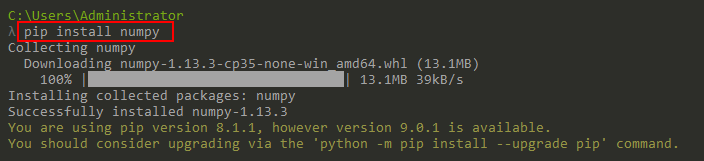

# Python Numpy Tutorial #

https://cs231n.github.io/python-numpy-tutorial/
https://docs.scipy.org/doc/numpy/reference/index.html

## Python ##

Python is a high-level, dynamically typed multiparadigm programming language. Python code is often said to be almost like **pseudocode**, since **it allows you to express very powerful ideas in very few lines of code while being very readable**. 

> multiparadigm该怎么理解呢？

### 1.1、安装Python ###

[参考文档](B.Python_installation.md)

### 1.2、查看Python版本 ###

There are currently two different supported versions of Python, 2.7 and 3.5. Somewhat confusingly, Python 3.0 introduced many backwards-incompatible changes to the language, so code written for 2.7 may not work under 3.5 and vice versa. For this article **all code will use Python 3.5**.

You can check your Python version at the command line by running `python --version`.

### 1.3、示例：快速排序 ###

As an example, here is an implementation of the classic quicksort algorithm in Python:


```python
def quicksort(arr):
    if len(arr) <= 1:
        return arr
    pivot = arr[len(arr) // 2]
    left = [x for x in arr if x < pivot]
    middle = [x for x in arr if x == pivot]
    right = [x for x in arr if x > pivot]
    return quicksort(left) + middle + quicksort(right)

print(quicksort([3,6,8,10,1,2,1]))
# Prints "[1, 1, 2, 3, 6, 8, 10]"
```
## 2、Numpy ##

[Numpy](http://www.numpy.org/) is the core library for scientific computing in Python. It provides a high-performance multidimensional array object, and tools for working with these arrays. 

- Arrays
- Array indexing
- Datatypes
- Array math
- Broadcasting

### 2.1、安装numpy ###

	pip install numpy



[NumPy v1.13 Manual](https://docs.scipy.org/doc/numpy/index.html)
[NumPy Reference](https://docs.scipy.org/doc/numpy/reference/index.html)

下载地址：

	https://www.lfd.uci.edu/~gohlke/pythonlibs/

## 2.2、Arrays ##

A numpy array is **a grid of values**, **all of the same type**, and **is indexed by a tuple of nonnegative integers**. The number of dimensions is **the rank of the array**; **the shape of an array** is a tuple of integers giving the size of the array along each dimension.

The N-dimensional array (`ndarray`)

https://docs.scipy.org/doc/numpy/user/c-info.python-as-glue.html

Using Python as glue

Many people like to say that **Python is a fantastic glue language**. Hopefully, **this Chapter will convince you that this is true**. [举例子]The first adopters of Python for science were typically people who used it to glue together large application codes running on super-computers. [讲Python的作为glue的优势]Not only was it much nicer to code in Python than in a shell script or Perl, in addition, the ability to easily extend Python made it relatively easy to create new classes and types specifically adapted to the problems being solved. [引出Numberic]From the interactions of these early contributors, **Numeric** emerged as **an array-like object** that could be used to pass data between these applications.

>声明观点：Python is a fantastic glue language。后面举例。

【由numeric到numpy】As **Numeric** has matured and developed into **NumPy**, people have been able to write more code directly in **NumPy**. Often this code is fast-enough for production use, but there are still times that there is a need to access compiled code. Either to get that last bit of efficiency out of the algorithm or to make it easier to access widely-available codes written in C/C++ or Fortran.


This chapter will review many of the tools that are available for the purpose of accessing code written in other compiled languages. There are many resources available for learning to call other compiled libraries from Python and the purpose of this Chapter is not to make you an expert. **The main goal is to make you aware of some of the possibilities** so that you will know what to “Google” in order to learn more.


https://docs.scipy.org/doc/numpy/user/c-info.beyond-basics.html

Beyond the Basics

>The voyage of discovery is not in seeking new landscapes but in having new eyes.
>— Marcel Proust
>
>Discovery is seeing what everyone else has seen and thinking what no one else has thought.
>— Albert Szent-Gyorgi

Iterating over elements in the array

Basic Iteration

One common algorithmic requirement is to be able to walk over all elements in a multidimensional array. The array iterator object makes this easy to do in a generic way that works for arrays of any dimension. Naturally, if you know the number of dimensions you will be using, then you can always write nested for loops to accomplish the iteration. If, however, you want to write code that works with any number of dimensions, then you can make use of the array iterator. An array iterator object is returned when accessing the .flat attribute of an array.

https://docs.scipy.org/doc/numpy/reference/arrays.ndarray.html

The N-dimensional array (`ndarray`)

An `ndarray` is a (usually fixed-size) multidimensional container of items of the same type and size. The number of dimensions and items in an array is defined by its `shape`, which is **a tuple of N positive integers** that specify the sizes of each dimension. The type of items in the array is specified by a separate **data-type object** (`dtype`), one of which is associated with each `ndarray`.

> 概念：ndarray、ndim、shape、dtype。ndarray描述的是一个多维的容器（multidimensional container），ndim指的是ndarray的维度个数，shape可以理解为各个维度的元素item数量，而dtype则是元素item的类型。
> 从整体上，介绍ndarray的概念，及其组成部分(ndim/shape/item/dtype)。

As with **other container objects** in Python, the contents of an ndarray can be accessed and modified by indexing or slicing the array (using, for example, N integers), and via the methods and attributes of the ndarray.

> "other container objects"，应该指的就是Python built-in container types: lists, dictionaries, sets, and tuples.
> ndarray提供的两种访问的修改元素的方式：indexing和slicing


