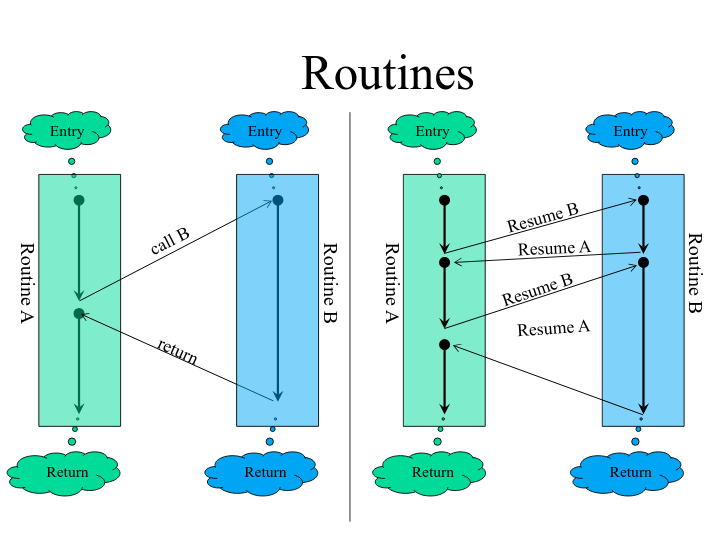

# Coroutine (3) 协程与线程的差异

在认知一件新事物的时候，通过不断的与其他事物的对比，能够帮助你对这个新的事物有更多的认知。

## 1、可与Coroutine进行对比的事物

与Coroutine进行对比的事物，我能想到的，有两个：

- Coroutines vs Subroutines
- Coroutines vs Threads

**Coroutines vs Subroutines**。与subroutine做对比，是因为coroutine的本质也是routine，但是subroutine和coroutine的执行过程有区别。通过代码的调用过程，能够更清楚的理解两者的差异。

**Coroutines vs Threads**，可能需要好好的解释一番。

## 2、Coroutines vs Threads

The difference between **coroutines** and **threads** is that rather than have the **OS** schedule execution of the various **threads**, **the developer** is free to schedule the execution of the **coroutines**. This is why they may be referred to as `lightweight threads` or `green threads`.

### 2.1、从多层次维度来认识协程

最初的视角：如何写一个coroutine程序

把视角稍微抬高一点，会发现：subroutine和coroutine都是在同1个线程中执行的。

把视角再抬高一点，会发现：多个线程也进行并发完成任务，多个线程是在同1个进程当中执行的。

把视角再抬高一点，会发现：多个进程也可以进行并发，这多个进程是在同1个服务器（电脑／笔记本／服务器）中运行的。

把视角再抬高一点，会发现：多个服务器也可以进行并发，这多个服务器是在同1个工作组（包含多个服务器）中的。

将coroutines和threads进行比较，它们本质上是不同层次的东西：coroutines是在同1个thread(线程)当中的多个routine进行合作／协作(cooperate)；而threads是在同1个Process(进程)当中的多个thread进行合作。

将coroutines和threads进行比较，只是因为它们在运行结果的表现形式上，存在某种相似性，这种相似性就是：并发(concurrency)。

并发的四个层次：

- routine并发
- 线程并发
- 进程并发
- 服务器并发

### 2.2、资源耗费成本

Assembly Language Co-Routines： https://slideplayer.com/slide/9856584/

